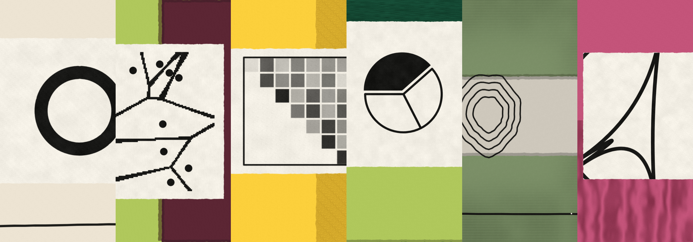
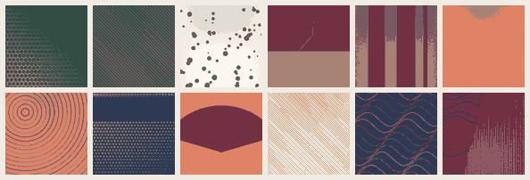

<div align="center">



# riso-press

**为 AI 时代的界面印制配图 —— 不调用任何生图模型。**

[](LICENSE)
[](https://python.org)
[](#安装)
[](#作为-agent-skill-使用)
[](CHANGELOG.md)

</div>

---

## 它解决什么

AI 能写出界面，但写不出配图。于是所有 AI 生成的页面都长着同一张脸：灰色占位方块、Unsplash 上那几张被用烂的照片，或者一堆糊成一团的渐变。

riso-press 用**算法印刷**替代这一环。半调网点、交叉排线、撕纸遮罩、套印错位、纸张颗粒——这些都是 1980 年代孔版印刷机的物理特性，可以被完整地建模成代码。

产出的是**成批风格统一、彼此不重复**的抽象构成图，没有训练数据来源问题，没有版权不明素材，没有 API 账单。

<div align="center">

<sub>12 幅，同一次运行，同一色系。10 种图案结构 × 18 色板 × 3 种遮罩。</sub>
</div>

---

## 安装

```bash
pip install pillow numpy
git clone https://github.com/Kerrywang64/taste-ui-design---art.git riso-press
cd riso-press
```

或一行装好（含依赖检查）：

```bash
curl -fsSL https://raw.githubusercontent.com/Kerrywang64/taste-ui-design---art/main/skill.sh | bash
```

只用 Pillow 与 numpy，**无网络调用**，脚本不安装任何东西。

---

## 60 秒上手

```bash
# 1. 生成 24 幅，同时出联系样张先看效果
python3 scripts/generate.py --count 24 --seed 7 --contact sheet.png

# 2. 装配成自包含的画廊页
python3 scripts/gallery.py --art art.json --out gallery.html
```

`--contact` 出的联系样张是给你的**验收关**：先看那一张缩略图，不满意就换 `--seed` 重跑，比逐张打开省事得多。

---

## 三个旋钮

跟调色板一样，这三个值决定成品的性格。都是 1–10，默认 5。

| 旋钮 | 低（1–3） | 高（8–10） | 控制什么 |
|---|---|---|---|
| `--density` | 极简，大量留白，多为单层 | 层次密集，副结构频繁出现 | 副结构出现概率（`D/12`） |
| `--contrast` | 柔和，同色系低反差 | 强烈，底与主色明度拉开 | 底色与主色的明度差下限（`60+C×14`） |
| `--texture` | 干净，接近矢量 | 年代感重，错位与颗粒明显 | 套印位移量与噪声 σ |

```bash
# 极简杂志内页
python3 scripts/generate.py --count 12 --density 2 --contrast 4 --texture 3 --palette cool

# 复古海报，做旧
python3 scripts/generate.py --count 12 --density 8 --contrast 9 --texture 9 --palette warm
```

---

## 全部参数

### `scripts/generate.py`

| 参数 | 默认 | 说明 |
|---|---|---|
| `--count` | 24 | 生成数量 |
| `--size` | 560 | 输出边长 px（内部固定 900 渲染后降采样） |
| `--colors` | 40 | 量化色数。降到 24 体积减半，且更像真版画 |
| `--seed` | 随机 | 随机种子。**同种子同参数 → 完全一致的结果** |
| `--palette` | all | `all` / `warm`（陶土赭石系）/ `cool`（青蓝橄榄系） |
| `--pattern` | 随机 | 锁定单一结构，做同系列时用 |
| `--density` `--contrast` `--texture` | 5 | 见上方三个旋钮 |
| `--out` | art.json | 输出 JSON（含 data-URI、标题、结构元数据） |
| `--contact` | — | 额外输出联系样张 PNG |

### `scripts/gallery.py`

| 参数 | 说明 |
|---|---|
| `--art` | 输入 JSON |
| `--out` | 输出 HTML（自包含，图以 data-URI 内嵌） |
| `--title` | 大标题，支持 `<i>` 斜体标签 |
| `--sub` | 副标题 |
| `--brand` / `--edition` | 页眉品牌与刊次 |
| `--layout` | `mosaic` 错落 / `quad` 双栏 / `solo` 单幅 |

---

## 图案结构

| key | 中文 | English | 视觉重量 | 适合 |
|---|---|---|---|---|
| `halftone` | 网点 | Halftone | 中 | 主结构，最像印刷 |
| `hatch` | 排线 | Hatch | 中 | 主或副 |
| `rings` | 涟漪 | Ripple | 轻 | 主结构，圆心可偏出画外 |
| `scatter` | 散点 | Scatter | 轻 | 副结构为主 |
| `waves` | 波纹 | Wave | 中 | 主结构，有机感最强 |
| `grid` | 网格 | Grid | 中 | 主结构 |
| `bars` | 竖条 | Stripe | 重 | 主结构，最有版式感 |
| `block` | 块面 | Block | 重 | 主结构，画面最简 |
| `trace` | 线迹 | Trace | 轻 | 副结构最佳 |
| `horizon` | 地平 | Horizon | 重 | 主结构，风景暗示最强 |

搭配经验、遮罩原理与后处理顺序见 [`references/patterns.md`](references/patterns.md)。
18 色完整色值与 5 条配色硬规则见 [`references/palette.md`](references/palette.md)。

---

## 三条设计纪律

这套东西容易做砸，砸法固定就那几种。以下三条是硬约束，改代码时不要破坏。

**1 · 一幅一个主结构。** 每张图 = 底色 + 一个满幅主结构 + 最多一个经遮罩的副结构。堆到三层以上，画面立刻变成"杂"——所有图看起来都像同一锅乱炖，这是最常见的失败模式。遮罩把副层锁在约 40% 面积内。

**2 · 标题必须从图里长出来。** 命名不是随机词库。标题 = `主色中文名 · 主结构中文名`，例如「赭石 · 涟漪」`Ochre Ripple`。看到名字就知道那张图长什么样。随机诗意词配随机图，两边都失去意义。

**3 · 大面积永远是中性或单色。** 底色要么是纸色 `#F3EEE5`，要么是与主色明度差达标的同族色。不要让两个高饱和色平分画面。

---

## 作为 Agent Skill 使用

仓库根目录就是一个标准 skill，`SKILL.md` 带触发描述。

**Claude Code / Cowork**

```
/plugin marketplace add Kerrywang64/taste-ui-design---art
/plugin install riso-press@riso-press-skill
```

**Cursor / Codex / 其他**

把仓库放进 `.cursor/skills/riso-press/` 或 `.agents/skills/riso-press/`，agent 会在你说「生成一批抽象配图 / 要 riso 质感 / 做个编辑风格画廊」时自动读 `SKILL.md`。

---

## 画廊页

`gallery.py` 产出的是一个自包含单文件，无外部依赖（字体走 Google Fonts，断网降级到系统衬线）。

- 三种排布实时切换：错落 / 双栏 / 单幅
- 结构过滤条**由实际生成的图自动推导**，不是硬编码
- 灯箱：点开放大，`←` `→` 翻页，`Esc` 关闭，图注显示主/副结构与色数
- 纸张噪声叠层、滚动渐显、`prefers-reduced-motion` 降级

体积参考：

| 配置 | 单幅 | 36 幅总计 |
|---|---|---|
| `--size 560 --colors 40` | ~190 KB | ~6.8 MB |
| `--size 480 --colors 24` | ~90 KB | ~3.2 MB |
| `--size 400 --colors 16` | ~45 KB | ~1.6 MB |

超过 40 幅建议改成外链 PNG：修改 `gallery.py` 把 `src` 写成文件路径而不是 data-URI。

---

## 扩展

**加图案**：在 `generate.py` 的 `PATTERNS` 里注册 `(函数, 中文名, 英文名)`，函数签名 `fn(draw, color, rng)`，在 900×900 画布作画。命名系统与画廊过滤条会自动接上。

**加颜色**：在 `PAL` 里加 `"key": ((r,g,b), "中文名", "English", "warm"|"cool")`。选色检查：转灰度后明度应落在 25%–75%。

自检两条：

1. 纸色底跑一次，深色底跑一次，两种都要成立
2. 缩到 240px 看联系样张 —— 缩小后仍能辨识的才算合格结构

---

## 常见问题

<details>
<summary><b>为什么不直接用生图模型？</b></summary><br>

三个理由。**可复现**：同种子同参数产出完全一致的结果，模型做不到。**零成本**：36 幅在普通笔记本上约 20 秒，没有 API 账单。**权属干净**：像素由本地算法生成，无训练数据来源问题，可自由商用。

代价是它只产出抽象构成——需要人物、实物、照片写实的场景，这套用不了。
</details>

<details>
<summary><b>能商用吗？</b></summary><br>

可以。图案手法（半调、排线、套印错位、撕纸遮罩）是印刷工艺传统，属公共领域；生成的图像由本地算法产生。本仓库 MIT 协议。

暖纸底 + 有限色板 + 衬线排版这套视觉语言同样是通用编辑设计传统。但做公开产品时请使用自己的品牌名、标识与文案。
</details>

<details>
<summary><b>出图太"杂"怎么办？</b></summary><br>

把 `--density` 调到 2–3。这个旋钮直接控制副结构出现概率，调低后大部分图会是干净的单层构成。再不满意就锁 `--pattern block` 或 `--pattern horizon`，这两种画面最简。
</details>

<details>
<summary><b>一组图风格不统一？</b></summary><br>

锁定 `--palette warm` 或 `--palette cool`。`all` 模式冷暖混排，一致性明显更低。做系列时优先锁一侧，再固定 `--seed` 便于回溯。
</details>

<details>
<summary><b>能生成透明底 PNG 吗？</b></summary><br>

目前不能。riso 后处理里的纸张颗粒与油墨不均是作用在整幅上的乘性场，透明区域会露馅。如果需要，把 `riso()` 换成只处理非透明像素，并跳过 `--colors` 量化。
</details>

---

## 路线图

- [ ] 外链 PNG 输出模式（大批量时替代 data-URI）
- [ ] 更多图案结构：晕线渐变、木纹、云纹
- [ ] 从一张参考图提取色板
- [ ] 画廊页的暗色版

欢迎提 issue 或 PR。加新图案时请附上联系样张截图。

---

## License

MIT — 见 [LICENSE](LICENSE)。
